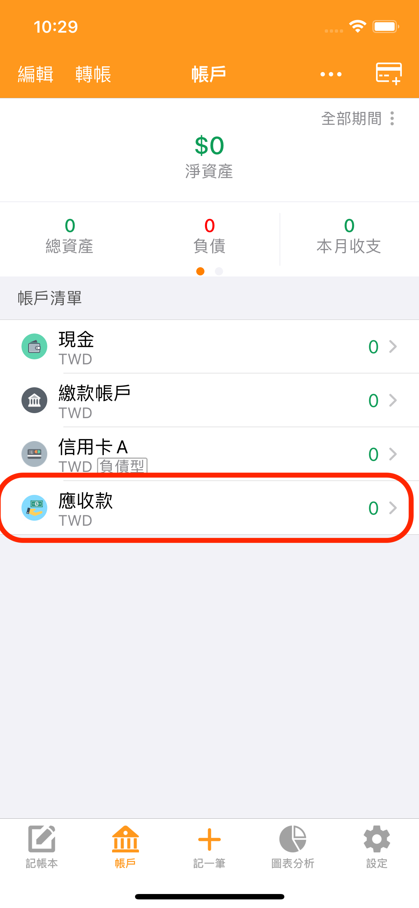
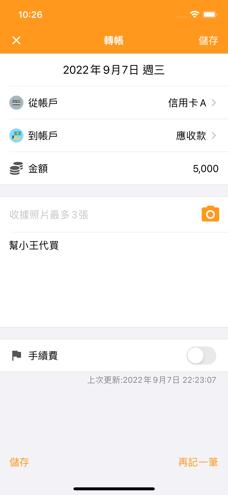
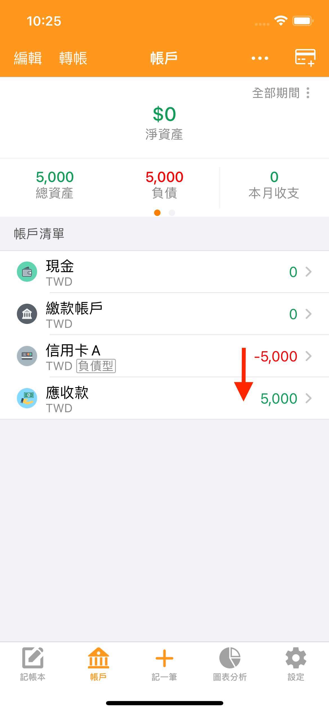
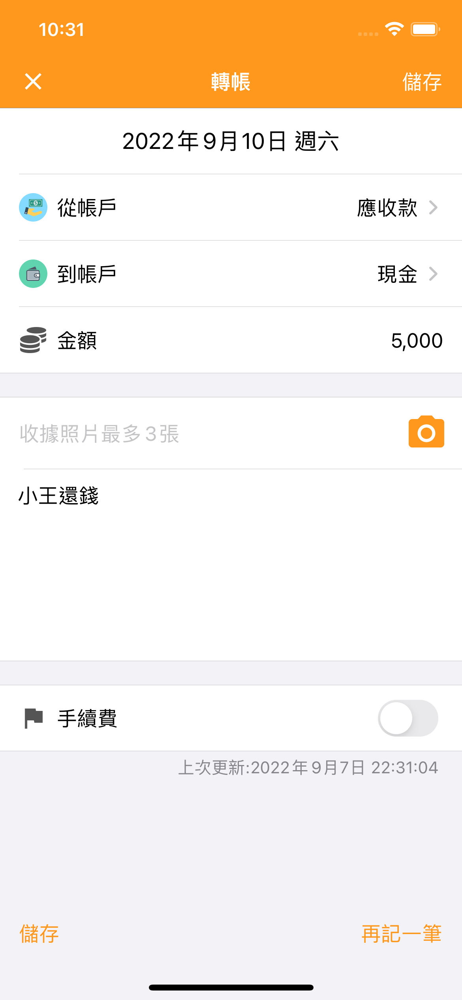
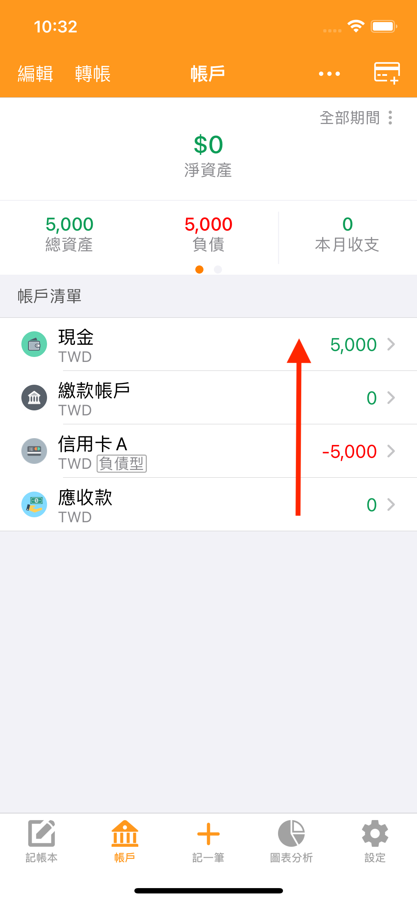

# 幫朋友代買物品怎麼記帳？

目前建議您自訂一個 **借出類型**的帳戶來管理。

※今後天天記帳會推出代買墊付方面的專屬功能

比如用信用卡A給朋友小王代買物品5,000元，可按如下記帳追蹤。

1.新增一個【借出】型帳戶【應收款】&#x20;

2.記一筆轉帳，從【信用卡A】划5,000元給【應收款】這個帳戶&#x20;

3.對方還錢如果還的是現金，則記一筆轉帳，把錢從【應收款】划回【現金】帳戶。

