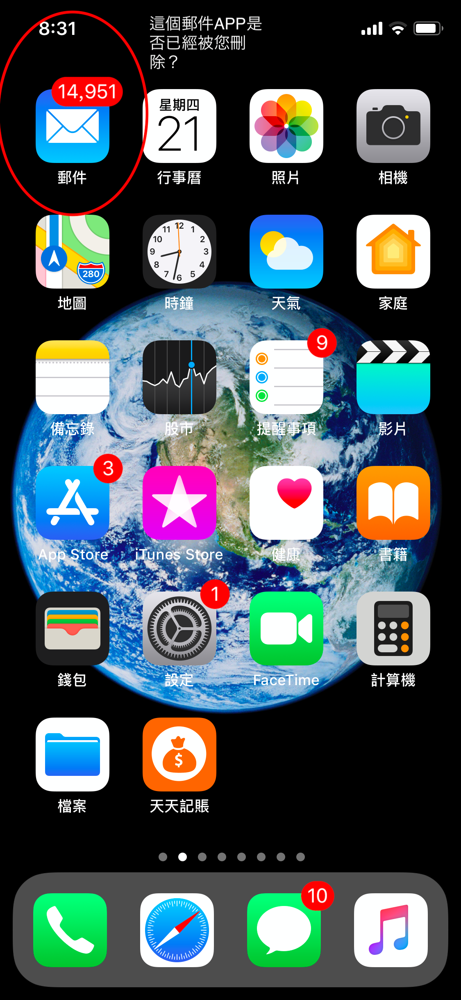

# CSV無法匯出，怎麼辦？

**1. 首先請確認Apple預設的【郵件】是否有刪除？**&#x20;

因為天天記帳的郵件最終是透過【郵件】這個預設的APP傳送的，

如果【郵件】APP有刪除，請把這個App重新安裝上，就應該能解決問題。

**2. 檢查【郵件】APP的「寄件匣」是否有未傳送的電子郵件**

【郵件】APP裡有積壓未傳送郵件也會造成CSV無法匯出。開啟【郵件】，然後下拉螢幕就可以寄出未傳送郵件。

**3. 檢查電子郵件帳號是否設定正確**

如果【郵件】APP沒問題，請參考下面的Apple的官方教學，檢查一下電子郵件設定。

將電子郵件帳號新增到 iPhone、iPad 或 iPod touch\
[https://support.apple.com/zh-tw/HT201320](https://support.apple.com/zh-tw/HT201320)\

