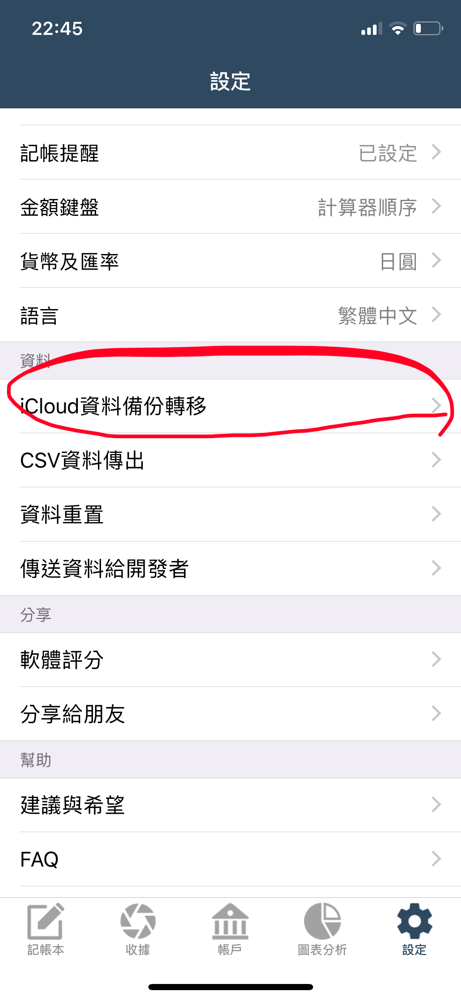
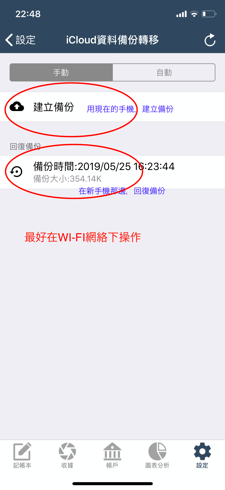

# 換手機時，如何將資料移到新手機上？

### 新手機如果是Android,請參考


[ru-he-jiang-zi-liao-zhuan-yi-dao-android-shou-ji-shang.md](ru-he-jiang-zi-liao-zhuan-yi-dao-android-shou-ji-shang.md)


### 新手機如果也是iOS系統

換手機時，天天記帳目前兩個方法可以把資料從舊手機轉移到新手機。\

**方法1 - 用天天記帳的iCloud資料備份轉移功能**

詳細使用方法如下。

**1.舊手機建立備份**

※天天記帳的設定 > iCloud資料備份轉移 > 建立備份

※建議在WI-FI環境下作業

**2.新手機打開天天記帳App，回復備份**\
\

#### **方法2 -** 花3美元購買iCloud雲帳本功能，然後把本機帳本全部變更為iCloud雲帳本。

這樣新手機那邊開啟天天記帳時，就會自動從雲端下載資料。\
**iCloud雲帳本的使用方法如下：**

1. 前往帳本清單介面
2. 把本機帳本更改為iCloud雲帳本

更詳細教學請參照→[https://tiantianjizhang-tw.swalloworkstudio.com/manual/cloud-book.html](https://tiantianjizhang-tw.swalloworkstudio.com/manual/cloud-book.html)\
\
如有不明白的地方，請隨時聯繫。
