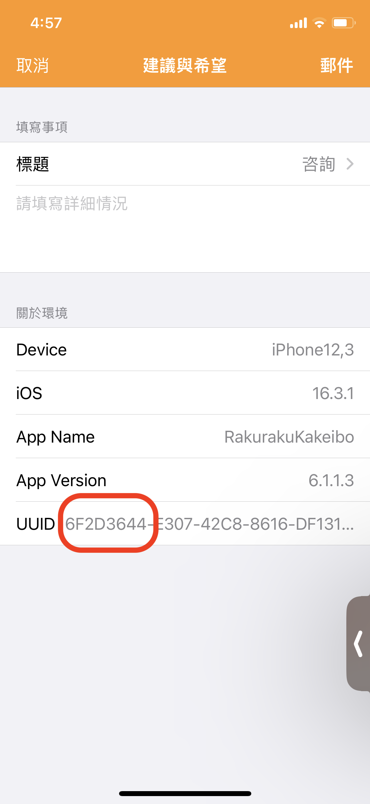
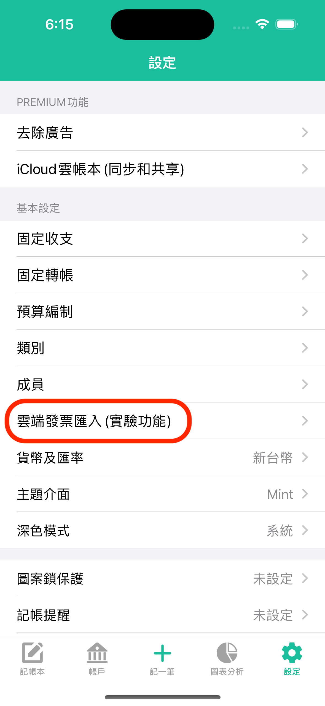
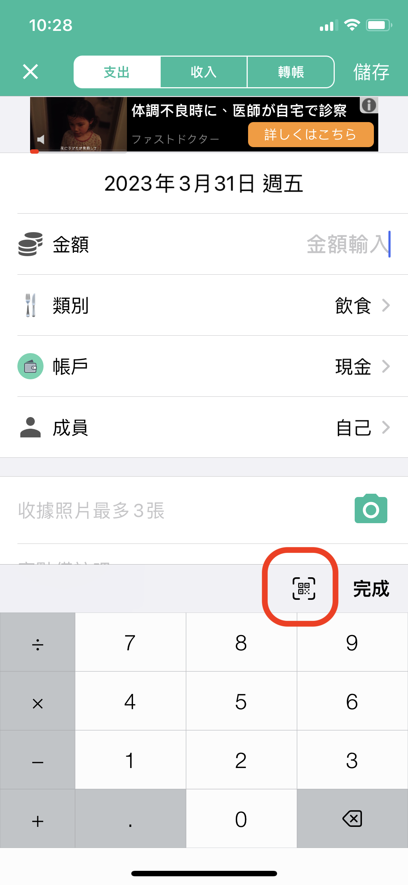

# 請問有載具雲端發票匯入功能嗎？


<mark style="color:red;">**非常抱歉地通知您，**</mark>

<mark style="color:red;">**由於政府電子發票系統近期進行了升級，「天天記帳」APP中的電子發票功能目前暫時無法使用。 對於這次服務中斷所帶來的不便，我們深感歉意。**</mark>

<mark style="color:red;">**我們會盡快調查並解決這個問題。 如果恢復服務，我們會再次通知您。**</mark>

<mark style="color:red;">**天天記帳敬上。**</mark>


雲端發票功能目前還在公開測試中, 僅對一部分使用者開放。&#x20;

如果您有需要，請從天天記帳的設定 > 建議與希望聯繫我們。

或者把這個介面UUID欄目的前8碼直接郵至swalloworks@gmail.com

**※以下是該功能的相關螢幕截圖**

1.雲端發票匯入&#x20;

※天天記帳的設定 > 雲端發票匯入

2. 電子發票掃描

