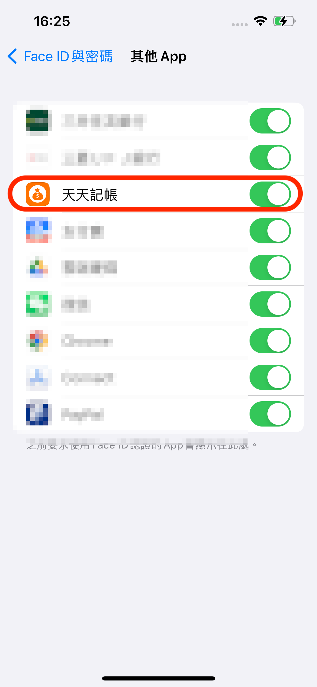

# 請問帳本如何設定密碼?

天天記帳目前有提供圖案鎖（Pattern Lock），也可以用FaceID等生物辨識鎖。

設定方法如下

1\. 前往天天記帳的設定 > 圖案鎖保護

2.開啟 圖案鎖保護 選項

&#x20;

3.設定 圖案(用手指連結三個以上的點)

&#x20;

天天記帳還能配合指紋(TouchID)和FaceID解鎖。&#x20;

只要您在圖案鎖設定頁面開啟FaceID解鎖便可以使用。

&#x20;

### ※如果FaceID解鎖的選項沒有顯示，請檢查iPhone的FaceD設定

### 檢查 Face ID 設定

若要檢查 Face ID 設定，請前往「設定」>「Face ID 與密碼」。確認[已設定 Face ID](https://support.apple.com/zh-tw/HT208109)，而且您想嘗試搭配 Face ID 使用的功能已開啟。

&#x20;

&#x20;

&#x20;

