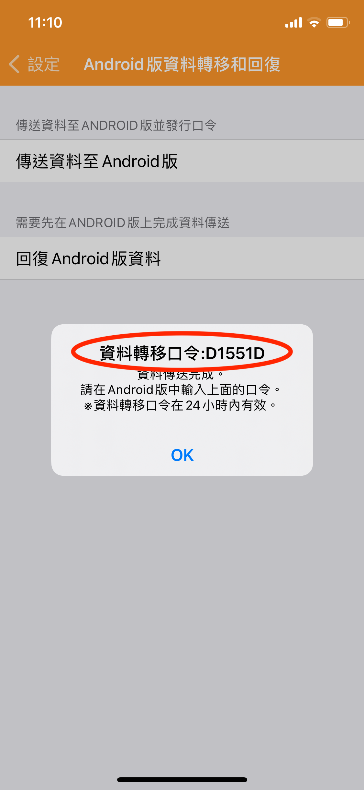

# 如何將資料轉移到Android手機上？

資料轉移到Android手機的操作如下:

1. **iOS版天天記帳先上傳資料**
   1. 前往設定 > Android版資料轉移和回復
   2. 點「傳送資料至Android版」
   3.  傳送完成後，會顯示一個資料轉移口令，記下這個號碼  &#x20;

       &#x20;
2. **Android版天天記帳回復資料**
   1. 前往Android版天天記帳的設定」 >「 iOS版資料轉移和回復」
   2. 點「回復iOS版資料」按鈕，輸入上述的口令號碼就可以了。
