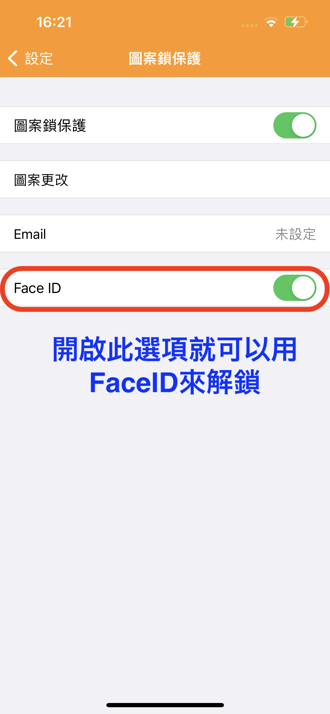
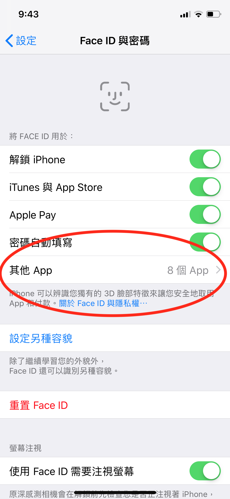
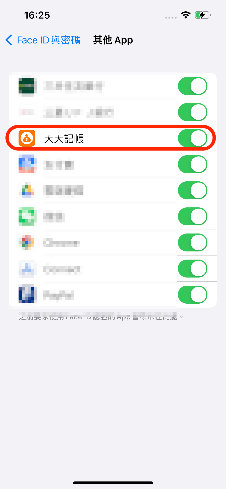

# 如何用FaceID等生物辨識鎖？

天天記帳的圖案鎖可以配合FaceID使用。

只要開啟FaceID選項就可以用FaceID來解鎖。

### ※如果FaceID解鎖的選項沒有顯示，請檢查iPhone的FaceD設定

### 檢查 Face ID 設定

若要檢查 Face ID 設定，請前往「設定」>「Face ID 與密碼」。確認[已設定 Face ID](https://support.apple.com/zh-tw/HT208109)，而且您想嘗試搭配 Face ID 使用的功能已開啟。

.png>)

