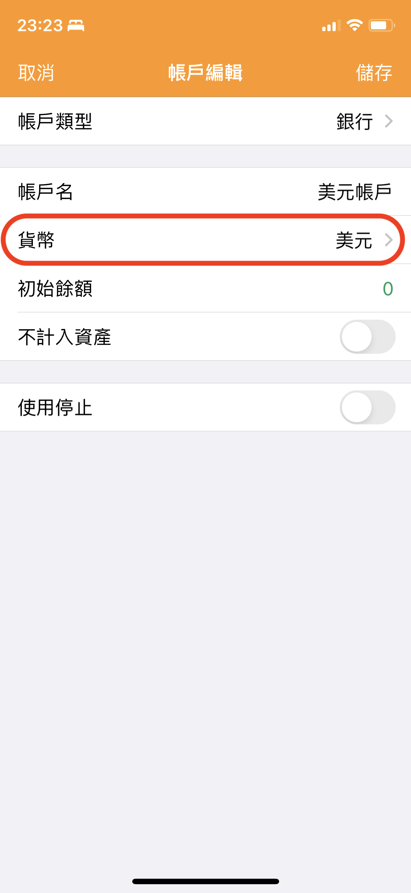
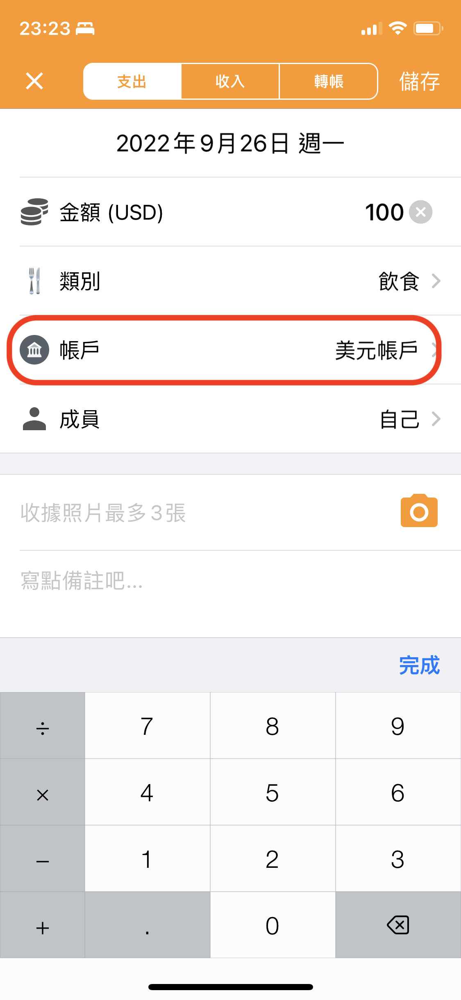
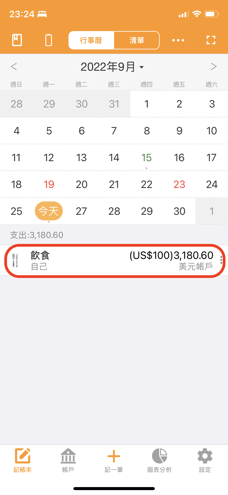

# 如何用外幣記帳？

要用外幣記帳需要自訂新增一個用來管理外幣的帳戶。另外還需要正確設定本(位)幣。

詳細使用方法如下：

#### 1. 首先確認本位幣的設定是否正確，請把最常用的貨幣設定為本位幣

※天天記帳的設定 > 貨幣及匯率 > 本位幣

#### 2. 新建外幣帳戶，貨幣欄請選擇相應的外幣

※點帳戶 > 帳戶頁面右上的新建帳戶按鈕

#### 3. 記收支時按外幣金額填寫，然後選擇外幣帳戶

