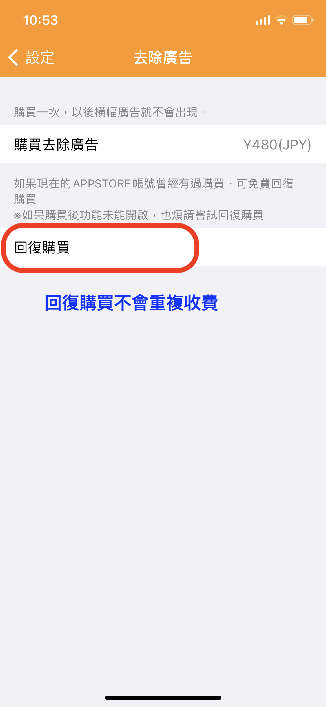

# 為何購買去除廣告，上面依然有廣告出現？

感謝購買，可能是信用卡沒有即時入帳的緣故。

### **1.麻煩您用回復購買功能再做一次去除廣告的處理。**&#x20;

**※天天記帳的設定-->去除廣告-->回復購買**

※回復購買不會重複收錢

&#x20;

### 2.如果回復購買不能解決問題，請確認訂單是否在【處理中】&#x20;

麻煩您確認一下購買記錄，有沒有顯示【處理中】的幾個字。&#x20;

如果是【處理中】代表還沒入帳，需要再入帳 **再執行回復購買**。

&#x20;

### 3.如果已經不是【處理中】，請確認Apple ID的設定需要更新或者需要重新驗證

#### 更新 Apple ID 設定

1.首先請前往手機的【設定】APP，確認一下有沒有【更新 Apple ID 設定】的提示

2.如果有，點擊「更新 Apple ID 設定」的選項，然後在後續步驟重新輸入並驗證一次 Apple ID 密碼就可以了。

### 4.如果上述都不能解決問題，請登出1次AppStore重新登入後再試試【回復購買】

登出操作如下：

1. 開啟App Store的APP
2. 點 右上帳號的icon
3. 向下滑動到介面的下邊，應該會有 【登出】按鈕出現
4. 登出1次
5. 重新登入

