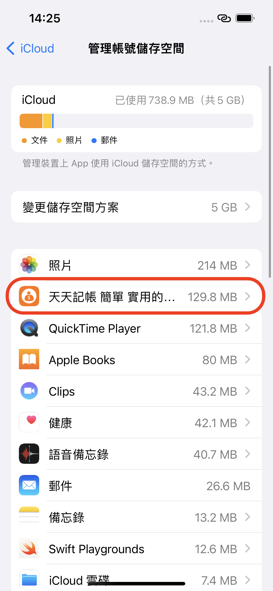

# 為什麼新手機看不到舊手機的備份檔

#### 1.首先請確認舊手機的備份是否有上傳到iCloud雲端。

&#x20;確認方法如下：

前往iPhone的「設定」> \[您的名稱] >「iCloud」>「管理帳號儲存空間」, 確認一下有沒有天天記帳的備份檔案

&#x20;

#### **2. 如果雲端還沒有備份檔，請檢查舊手機的**iCloud設定，如有必要登出1次Apple ID後，重新備份

&#x20;2.1  請按下面的連結正確設定iCloud



&#x20; 2.2 如果iCloud設定沒問題，請登出1次AppleID


[ru-he-deng-chu-appleid.md](ru-he-deng-chu-appleid.md)


#### **3. 如果雲端已有備份檔案，請檢查新手機的**iCloud設定，如有必要登出1次Apple ID

#### &#x20;

\
