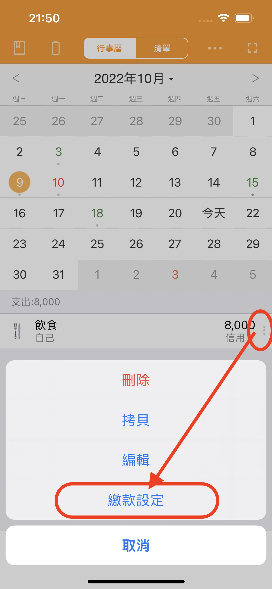
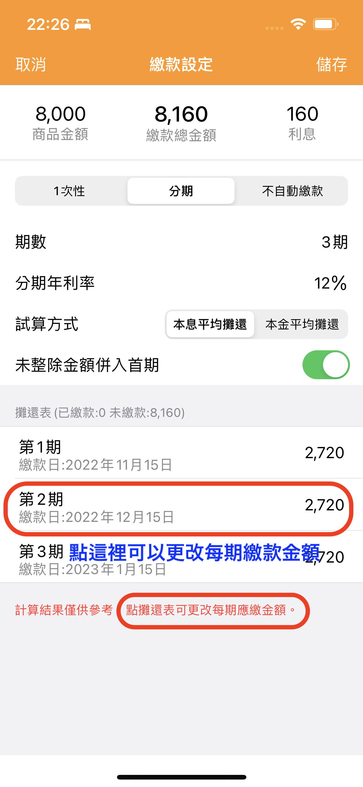

# 信用卡分期如何設定

天天記帳目前可以對單筆信用卡消費設定分期。&#x20;


**前提：**

信用卡分期能否設定，需要滿足下面的2個前提。&#x20;

1.該信用卡账户需要開啟自動繳款選項&#x20;

2.相關信用卡支出的繳款日是未來日期。如果繳款日已經是過往的日期，則不能追加設定。



具體操作如下：

#### 1.在行事曆或清單介面，點要分期支出記錄右側的按鈕，然後選擇【繳款設定】

#### 2. 繳款設定介面有試算功能。可以在試算結果的基礎上再調整每期繳款金額。

#### 3. 每期繳款金額設定完畢後，按右上【儲存】按鈕。

